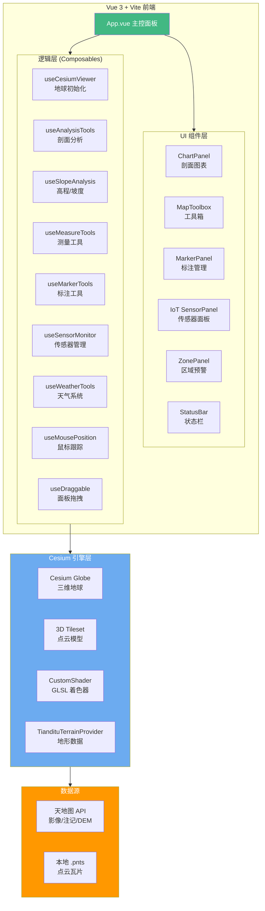

# ⛰️ 滑坡监测数字孪生系统

> Landslide Monitoring Digital Twin System —— 基于 Cesium.js + Vue 3 的三维 WebGIS 滑坡监测平台

[](https://github.com/shawnJin-cmd/landslide-monitor/actions/workflows/deploy.yml)
[](https://vuejs.org/)
[](https://cesium.com/)
[](https://vite.dev/)

## 📖 项目背景

滑坡是全球最常见的地质灾害之一，我国西南山区尤为严重。传统监测手段依赖人工巡查、单点传感器，缺乏宏观空间感知与可视化能力。本系统利用**数字孪生**理念，将高精度倾斜摄影三维点云、IoT 传感器实时数据、气象环境信息融合到 Cesium 三维地球引擎中，构建一个可交互、可分析、可预警的滑坡监测一体化平台。

## ✨ 核心功能

### 🗺️ 三维可视化
- **天地图卫星影像 + 注记** 叠加显示
- **高精度点云瓦片**（.pnts 格式）加载，覆盖 >60 块局部区域
- **自定义地形 Provider**，接入天地图 DEM 高程数据
- EDL（Eye-Dome Lighting）模式增强点云立体感

### 📊 空间分析
- **剖面分析**：点击起点/终点自动采样高程，生成 ECharts 地形剖面图，支持图表 ↔ 模型双向联动高亮
- **高程分级着色**：基于 GLSL CustomShader 将模型按海拔绿→黄→红三级渲染
- **坡度分析**：读取点云 BatchTable 法线属性（NormalZ），区分陡坡 (>53°) / 中坡 / 缓坡

### 📏 测量工具
- 多点折线 **距离测量**
- 多边形 **面积测量**（ENU 局部坐标鞋带公式）
- 两点 **高差测量**

### 📍 标注系统
- 监测点、警示点、信息点标注
- **多边形危险区**绘制，自动计算面积与几何中心
- 标注导入/导出（JSON 格式）
- 点击标注飞行定位

### 📡 IoT 传感器监测
- 模拟 4 类传感器：**GNSS 位移计、裂缝计、雨量计、倾斜仪**
- 实时数据模拟与阈值告警（正常/预警/危险 三级）
- 传感器 ↔ 危险区域联动：点面空间关系自动判定，区域颜色随传感器状态动态变化
- 传感器飞行定位、模拟告警测试

### ☁️ 气象模拟
- **降雨特效**：基于 PostProcessStage 的屏幕空间 GLSL 着色器，可调降雨强度
- 雨天自动调整大气散射、雾效参数（色调偏移、饱和度、能见度）

### 🔴 裂缝图层
- 独立控制裂缝数据图层的显示/隐藏

## 🏗️ 系统架构



## 🛠️ 技术栈

| 类别 | 技术 | 说明 |
|------|------|------|
| 前端框架 | Vue 3.5 (Composition API) | 响应式 UI，`<script setup>` 语法 |
| 构建工具 | Vite 7 | 极速 HMR 开发体验 |
| 三维引擎 | Cesium.js 1.137 | 三维地球渲染、3D Tiles、GLSL 着色器 |
| 图表库 | ECharts 6 | 地形剖面图可视化 |
| 瓦片数据 | .pnts (Point Cloud) | 倾斜摄影点云，CesiumLab 切片 |
| 底图服务 | 天地图 API | 卫星影像 (img_w)、注记 (cia_w)、DEM |
| 部署 | GitHub Pages + Actions | CI/CD 自动构建部署 |

## 📁 项目结构

```
landslide-monitor/
├── index.html                          # 入口 HTML
├── vite.config.js                      # Vite 配置（Cesium 插件、路径别名）
├── package.json                        # 项目依赖
├── .github/workflows/deploy.yml        # GitHub Actions 自动部署
├── public/
│   └── 2026 2 7 17 12/                 # 点云瓦片数据（.pnts + .json）
│       ├── 12_0_6450_2760.pnts         # L12 级瓦片
│       ├── 13_0_12900_5521.pnts        # L13 级瓦片
│       ├── ...
│       └── 17_10_*.pnts                # L17 级瓦片（最高精度）
└── src/
    ├── main.js                         # Vue 应用入口
    ├── App.vue                         # 主组件（面板布局、状态管理）
    ├── assets/                         # 静态资源
    ├── components/                     # UI 组件
    │   ├── ChartPanel.vue              #   剖面图 ECharts 组件
    │   ├── MapToolbox.vue              #   右侧工具箱
    │   ├── MarkerPanel.vue             #   标注管理面板
    │   ├── SensorPanel.vue             #   IoT 传感器面板
    │   ├── StatusBar.vue               #   底部经纬度/高程状态栏
    │   └── ZonePanel.vue               #   区域预警面板
    ├── composables/                    # 可组合逻辑模块
    │   ├── useCesiumViewer.js          #   Viewer 初始化、图层配置、429 重试
    │   ├── useAnalysisTools.js         #   剖面分析（采样、插值、联动高亮）
    │   ├── useSlopeAnalysis.js         #   高程/坡度 CustomShader
    │   ├── useMeasureTools.js          #   距离/面积/高差测量
    │   ├── useMarkerTools.js           #   标注增删改查、危险区多边形
    │   ├── useSensorMonitor.js         #   IoT 传感器模拟、告警阈值
    │   ├── useWeatherTools.js          #   降雨 GLSL 后处理特效
    │   ├── useMousePosition.js         #   鼠标经纬度跟踪
    │   ├── useDraggable.js             #   面板拖拽
    │   └── useTilesetControl.js        #   3D Tiles 控制
    └── utils/
        └── TiandituTerrainProvider.js  #   自定义天地图地形 Provider
```

## 🚀 快速开始

### 环境要求

- **Node.js** >= 20.19 或 >= 22.12
- **npm** >= 9

### 安装与运行

```bash
# 1. 克隆项目
git clone https://github.com/shawnJin-cmd/landslide-monitor.git
cd landslide-monitor

# 2. 安装依赖
npm install

# 3. 启动开发服务器
npm run dev

# 4. 浏览器访问
# http://localhost:5173/landslide-monitor/
```

### 生产构建

```bash
npm run build      # 构建到 dist/
npm run preview    # 本地预览构建结果
```

## 🔄 CI/CD 自动部署

项目配置了 GitHub Actions，每次推送到 `main`/`master` 分支时自动：

1. Checkout 代码 → 安装 Node 22
2. `npm ci` → `npm run build`
3. 修复 Cesium 路径嵌套问题
4. 部署到 GitHub Pages

在线地址：`https://shawnJin-cmd.github.io/landslide-monitor/`

## 🎯 关键实现细节

### 1. 自定义天地图地形 Provider

手写实现了 Cesium `TerrainProvider` 接口，从天地图 DEM 服务获取高程数据：

- 解析 `Uint16Array` 高度场 → 转换为 `HeightmapTerrainData`
- 读取子瓦片掩码控制 LOD 加载
- 多 URL 负载均衡（`(x+y) % urls.length`）

### 2. 429 限流智能重试

天地图免费版限制并发请求，系统通过以下策略保障稳定性：

```js
// 限制并发数
Cesium.RequestScheduler.maximumRequestsPerServer = 1;

// 拦截器 + 指数退避重试
if (statusCode === 429) {
    setTimeout(retry, 2^attempt * 1000);
}
```

### 3. 高程着色 CustomShader

使用 Cesium `CustomShader` API 在 GPU 上实时计算每个顶点相对于椭球基准面的高度，按三级渲染：

- 🟢 低海拔 (0-33%)：`#33b34d`
- 🟡 中海拔 (33-66%)：`#ffd933`
- 🔴 高海拔 (66-100%)：`#e63326`

### 4. 传感器 ↔ 区域联动

基于射线法（Ray Casting）判定传感器是否位于危险区内，区域颜色**实时跟随**内部传感器最高风险等级变化：

- L1 🚨 红色：有传感器处于 `danger` 状态
- L2 🟠 橙色：全为 `normal` 或 `warning`，至少一个 `warning`
- L3 🟢 绿色：全为 `normal`

## 📝 未来展望

- [ ] 接入真实 MQTT/WebSocket IoT 数据流
- [ ] 历史数据回放与趋势分析
- [ ] 引入 InSAR 形变时序数据
- [ ] 预警消息推送（邮件/短信/钉钉）
- [ ] 多视角对比（分屏展示不同时段模型）
- [ ] 移动端适配

## 📄 开源协议

MIT License

---

> 🎓 本项目为本科毕业设计作品，如有问题或建议欢迎提 Issue。

